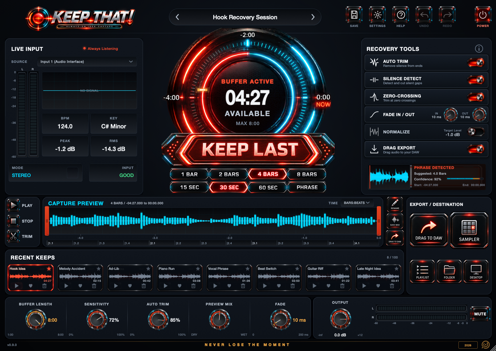

<div align="center">

# KEEP THAT!

**Always-On Idea Capture** &middot; by [Diamond Loopz](https://diamondloopz.com)

*The best take is usually the one nobody was recording.*



</div>

---

KEEP THAT! keeps a rolling buffer of everything going through it. When you play
something worth keeping and the recorder was not running, press **KEEP LAST**
and pull it back — the last bars, the last seconds, or the last musical
phrase — trimmed, faded and ready to drag into your project.

There is nothing to arm. It is capturing from the moment it loads.

## What it does

| | |
|---|---|
| **Rolling buffer** | Up to 8 minutes of continuous history, lock-free, allocation-free on the audio thread |
| **Recover by musical unit** | 1/2/4/8 bars (following host tempo), 15/30/60 seconds, or the last detected phrase |
| **Phrase detection** | Finds where the last musical idea actually started, rather than cutting at an arbitrary point |
| **Automatic cleanup** | Silence trim, zero-crossing snap, fades, normalise — applied as the capture is made |
| **Key and tempo** | Chroma + Krumhansl-Kessler key detection; tempo estimated when the host reports none |
| **Drag to DAW** | Drag a capture straight into your project, or write a 24-bit WAV |
| **Undo/redo** | Over delete, rename, favourite and capture — never over automation |

## Formats

| Platform | Formats | Built by |
|---|---|---|
| macOS 11+ | VST3, Audio Unit, Standalone — universal (Apple Silicon + Intel) | `Makefile`, signed with Developer ID |
| Windows | VST3, Standalone | `CMakeLists.txt` via GitHub Actions |

## Building

### macOS (the retail path)

The Makefile is the authority for what ships on Mac. It needs only the Command
Line Tools — no Xcode, no CMake, no Homebrew.

```bash
make            # VST3 + AU + Standalone, signed
make test       # VST3 probe + DSP test suite
make dsptest    # 99 deterministic DSP checks
make uishot     # headless render of the editor, diffed against the approved art
```

Retail:

```bash
make universal  # x86_64 + arm64 slices, lipo'd and re-signed
make installer  # signed .pkg
make notarize   # requires stored credentials, see below
make release    # zip: installer + read me
```

> **Note:** build with at most `-j 2`. Higher parallelism makes clang run out of
> memory on `juce_graphics_Harfbuzz`.

Notarization needs credentials stored once, by you:

```bash
xcrun notarytool store-credentials KeepThat --apple-id YOU@EXAMPLE.COM --team-id 922D43C6FJ --password APP-SPECIFIC-PASSWORD
```

### Windows

Windows binaries are built in CI, because the development machine is a Mac with
no Windows toolchain. Push a tag and the workflow builds and attaches them:

```bash
git tag v0.9.0 && git push origin v0.9.0
```

Locally on a Windows box:

```bash
cmake -B build -G "Visual Studio 17 2022" -A x64
cmake --build build --config Release
```

## Repository layout

```
Source/           the plugin
  capture/        rolling buffer, phrase/key/tempo detection, capture engine
  ui/             panels, widgets, theme; Theme.h holds the whole layout table
  export/         WAV writing and drag-out
  state/          presets and the undo history
Assets/           the approved v1.4 artwork
tools/            png.py, gif.py, mkvideo.m, UIShot, DspTest
packaging/        Info.plists, entitlements, icon, installer
docs/             milestone records
```

## Tooling notes

This project carries a few tools written for it, because the build machine has
no PIL, no numpy and no ffmpeg:

- `tools/png.py` — pure-Python PNG reader/writer/differ. Its `edges` and `diff`
  commands drove the match against the approved artwork.
- `tools/gif.py` — animated GIF encoder with frame differencing and LZW.
- `tools/mkvideo.m` — PNG sequence to H.264, straight against AVFoundation.
- `tools/UIShot.cpp` — renders the editor headlessly, including animations
  (`frames=N`) and a real capture (`keepat=N`).
- `tools/DspTest.cpp` — 99 deterministic checks that validate their own
  measurements before trusting them.

---

<div align="center"><i>NEVER LOSE THE MOMENT</i></div>
